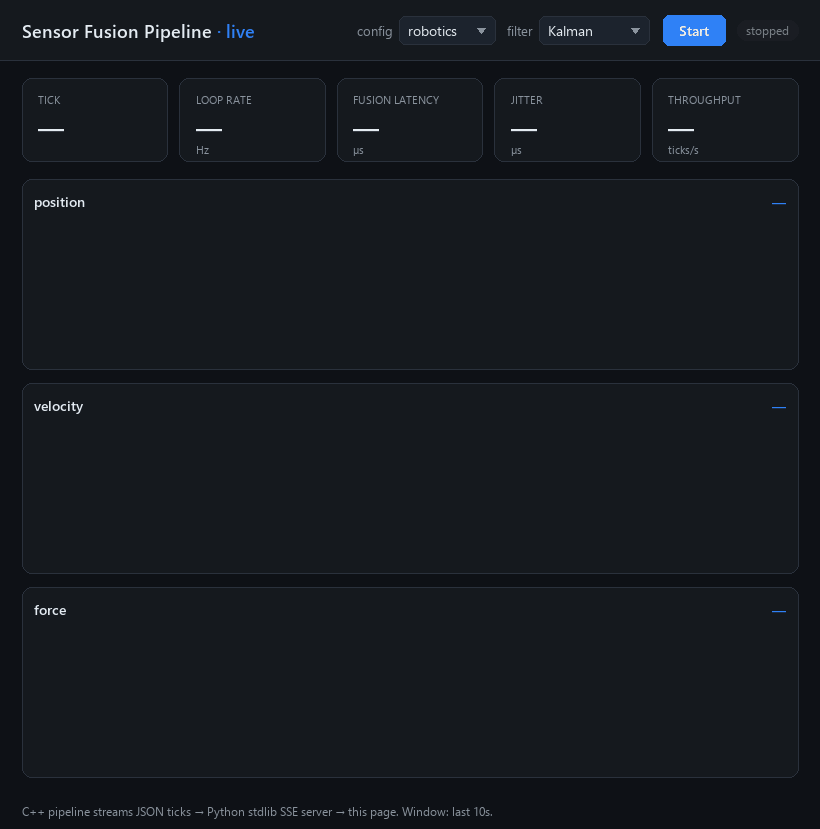
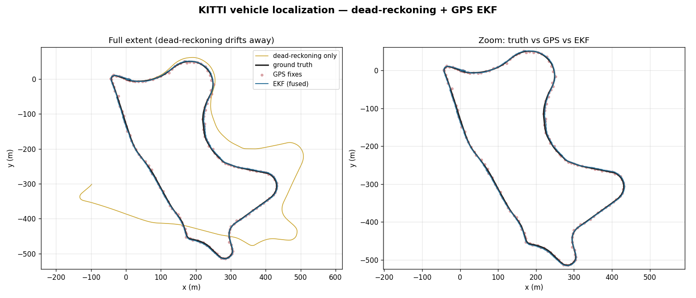

# Real-time multi-sensor fusion pipeline

[](https://github.com/lucaslombanaarias/sensor-fusion-pipeline/actions/workflows/ci.yml)

A modular C++17 pipeline that fuses concurrent, noisy sensor streams into a
single real-time state estimate at a fixed 200 Hz loop, with per-run latency
and jitter measured from a fixed-memory histogram. One config struct swaps the
entire pipeline between an EV battery-pack monitor (temperature / voltage /
current) and a robot-arm joint estimator (position / velocity / force) — the
hot path is lock-free and allocation-free, and the whole thing is
standard-library-only: no ROS, no Boost, no Eigen.



> **Live [dashboard](#live-dashboard).** The C++ pipeline streams JSON ticks to
> the browser over Server-Sent Events. Flipping one dropdown swaps the whole
> pipeline — and every chart — from a robot-arm joint estimator to an EV
> battery monitor, live.

| Metric | Result |
| --- | --- |
| [Fusion latency](#results-at-a-glance) | **0.38 µs** mean (376 ns) · p50 / p99 / p99.9 reported per run |
| [Lock-free vs locked](#results-at-a-glance) | **1.9×** lower mean fusion latency than a mutex-backed buffer |
| [EKF on real KITTI](#extended-kalman-filter--imugps-localization-on-kitti) | **1.77 m** RMSE fused — beats raw GPS (2.19 m) and dead-reckoning (167 m) |
| [Loop rate](#results-at-a-glance) | **199.4 Hz** against a 200 Hz target |

**What's notable:** lock-free SPSC/MPSC ring buffers, TSan-clean · validated on
real KITTI GPS/IMU data · live in-browser dashboard · zero external
dependencies. (The pipeline itself is dependency-free; matplotlib is used only
by the optional out-of-process plotting scripts.)

## Results at a glance

Battery config, 200 Hz estimator, 4 sensors, 30 s run, stock Linux:

- **Fusion latency: 0.38 µs mean** (376 ns), p50 / p99 / p99.9 and max
  all reported per run from a fixed-memory histogram
- **Loop rate: 199.4 Hz** against a 200 Hz target
- **Jitter: 35 µs mean, 102 µs stddev** (OS-scheduler bound)
- **~50,800 sensor samples fused, 0 dropped**
- **Lock-free buffers run ~1.9x lower mean fusion latency than mutex-backed**


The Kalman filter tracking the robot-arm joint, plotted as error vs the
true trajectory — the raw encoder (red) against the filtered estimate
(blue):


And the headline real-data result: an **Extended Kalman Filter fusing
dead-reckoning (forward speed + gyro yaw-rate) with GPS, on a real
[KITTI](https://www.cvlibs.net/datasets/kitti/) drive** (~1 km, 1594
frames). Dead-reckoning alone drifts to **167 m** RMSE, raw GPS sits at
**2.19 m**, and the fused EKF reaches **1.77 m** — better than either:



Full methodology, the lock-free-vs-locked comparison, the tail-latency
percentiles, and the KITTI EKF evaluation are in
[benchmarks/results.md](benchmarks/results.md).

## Architecture

```
 sensor 0 ─► [SPSC ring] ─┐
 sensor 1 ─► [SPSC ring] ─┤
 sensor 2 ─► [SPSC ring] ─┼─► estimator (200 Hz) ─► [SPSC ring] ─► logger ─► CSV
 sensor 3 ─► [SPSC ring] ─┘      fuse + measure
```

Each sensor producer runs in its own thread and publishes a noisy
reading at its configured rate through its own single-producer,
single-consumer ring buffer. The estimator thread runs a fixed-rate
loop: it drains every sensor buffer, fuses the readings into a state
estimate, measures its own latency and jitter, and pushes the result
through a second ring buffer to the logger thread, which writes
timestamped CSV.

The ring buffers fully decouple the threads. A slow disk write can only
ever cause log records to drop — it can never stall the estimator. A
slow estimator can only cause sensor samples to drop — it can never
block a sensor. Nothing on the estimator's hot path takes a lock or
allocates.

### One tick, end to end

What actually happens on each of the estimator's 200 ticks per second, and
why each step is shaped the way it is:

1. **Producers publish, asynchronously.** Every sensor thread runs its own
   fixed-rate `sleep_until` loop and writes `value(t) = true + drift·t +
   N(0, σ)` into *its own* SPSC ring (`include/sensor.hpp`). They never
   coordinate with the estimator or each other; a full ring drops the new
   sample and bumps a counter rather than blocking (staleness beats stalling).

2. **The estimator wakes precisely.** A two-stage wait — coarse
   `sleep_until(deadline − spin_window)` then a short busy-spin to the
   deadline — trades ~2% of a core for single-digit-µs deadline accuracy on a
   non-RT kernel (`include/estimator.hpp`).

3. **Drain, newest-wins.** It non-blockingly pops each sensor ring until
   empty, keeping the freshest reading per channel plus a bitmask of which
   channels reported this tick. No locks, no waiting on a slow sensor.

4. **Fuse.** Per channel it computes the inverse-variance weighted mean
   `fused = Σ(wᵢ·zᵢ) / Σ(wᵢ)`, `wᵢ = 1/σᵢ²` — the ML estimate under Gaussian
   noise. For the robotics Position/Velocity pair an optional complementary or
   Kalman filter (`--kalman`) refines the estimate and *coasts on the velocity
   integral* on ticks with no fresh encoder sample, so the state is always
   present.

5. **Measure itself.** The wall-clock spent in steps 3–4 is the fusion
   latency. It feeds an O(1) Welford accumulator (mean/stddev/min/max) and a
   fixed-memory log-bucketed histogram (`include/histogram.hpp`) for the
   p50/p99/p99.9 tail — all without allocating on the hot path.

6. **Publish and resync.** The `FusedState` is pushed into the *second* SPSC
   ring for the logger thread to write as timestamped CSV (or, under
   `--stream`, emitted as one JSON line for the [live dashboard](#live-dashboard)).
   The loop then resyncs to the next deadline without catch-up bursts after a
   preemption.

The per-module rationale for each of these pieces is in
[Design notes](#design-notes) below.

## Build and run

CMake:

```bash
mkdir build && cd build
cmake .. && make
ctest --output-on-failure        # run the test suite
./sfp --config battery --duration 30 --compare --csv out.csv
```

Or with the bundled Makefile:

```bash
make            # builds ./build/sfp and the tests
make test       # runs all test suites
./build/sfp --config robotics --duration 30 --csv robot.csv
```

Plot the CSV (needs `pip install matplotlib`):

```bash
python3 scripts/plot_latency.py out.csv latency.png
```

### Windows (MSVC)

The pipeline is standard C++17 and also builds and passes its full test
suite under MSVC. From a *x64 Native Tools* prompt:

```bat
cl /std:c++17 /O2 /EHsc /D_CRT_SECURE_NO_WARNINGS /Iinclude src\main.cpp /Fe:sfp.exe
```

(`_CRT_SECURE_NO_WARNINGS` silences MSVC's nag about standard `fopen`,
which is the warning-free default under g++/clang.)

`include/platform.hpp` requests 1 ms timer resolution on Windows
(`timeBeginPeriod`) for the duration of the process — without it the
default ~15.6 ms scheduler tick prevents the fixed-rate loops from
hitting their deadlines. It is a compiled-out no-op on POSIX. Note that
the **headline latency/jitter figures above are Linux numbers**;
Windows reproduces the lock-free-vs-locked *advantage* but with much
larger scheduler jitter, and sensor rates at/above ~1 kHz are bounded by
the 1 ms Windows timer floor rather than by the pipeline.

### CLI

```
sfp [--config battery|robotics] [--duration SECONDS]
    [--spin-us N] [--csv PATH] [--compare] [--kalman] [--stream]
```

- `--config`   which sensor set to simulate (default battery)
- `--duration` benchmark length in seconds (default 30)
- `--spin-us`  busy-wait window before each deadline (default 50)
- `--csv`      output path (default fusion_log.csv)
- `--compare`  run lock-free and locked back to back, print a table
- `--kalman`   use the Kalman filter for Position/Velocity instead of the
               complementary filter (meaningful for the robotics config)
- `--stream`   emit one JSON object per fused tick to stdout (feeds the
               live dashboard); no CSV, no banner on stdout

## Live dashboard

A real-time browser view of the pipeline — sensor traces, the fused
estimate, and live latency/jitter — instead of static PNGs.

```bash
make                          # (or cmake) build sfp first
python3 dashboard/server.py   # then open http://localhost:8000
```

The data path is **`sfp --stream` (C++) → `dashboard/server.py`
(Python standard library, Server-Sent Events) → the browser**
(`dashboard/index.html`, vanilla JS + Canvas, no chart library). The
server launches the pipeline, relays each JSON tick to the page, and the
page redraws scrolling charts on every frame. Pick the config (battery /
robotics) and filter (Kalman / complementary / raw) in the header and
hit Start; closing the stream stops the underlying `sfp` process.

No new dependencies: the C++ side stays standard-library-only, the
server is stdlib Python, the frontend is plain HTML/CSS/JS.

## Design notes

### SPSC ring buffer (`include/ring_buffer.hpp`)

The lock-free buffer is the foundation. Key decisions:

- **Monotonic counters, masked indexing.** `head_` and `tail_` count up
  forever; the slot index is `head_ & (Capacity - 1)`. Empty when
  `head == tail`, full when `head - tail == Capacity`. Power-of-two
  capacity (enforced by `static_assert`) makes the wrap a bitmask, not a
  modulo.
- **Acquire/release pairing.** Each thread uses relaxed ordering on the
  counter it owns and acquire/release on the counter the other thread
  publishes. The producer's release-store of `head_` synchronizes with
  the consumer's acquire-load, guaranteeing the buffer write is visible.
- **Cache-line padding.** `head_`, `tail_`, `dropped_`, and the storage
  each sit on their own 64-byte line so the producer and consumer never
  invalidate each other's cache lines (false sharing).
- **Drop on full, never block.** A full buffer drops the new item and
  bumps a counter rather than blocking — staleness beats blocking in a
  real-time loop.
- **`MpscRingBuffer` for multiple writers.** A bounded Vyukov-style
  variant where any number of producers can `push()` concurrently: each
  slot carries an atomic sequence number and producers claim a position
  with a CAS, so there's no lock and no single-writer assumption. Same
  interface and drop policy; `test_mpsc` hammers it with four producer
  threads (and CI runs that under ThreadSanitizer).

A `LockedRingBuffer` with an identical interface backs the benchmark
comparison.

### Sensor producer (`include/sensor.hpp`)

`value(t) = true_value + drift_rate·t + N(0, noise_stddev)`. Fixed-rate
`sleep_until` loop with deadline resync (no catch-up bursts after a
preemption). RNG seeded per sensor id so same-channel sensors produce
uncorrelated noise.

### Estimator (`include/estimator.hpp`)

The timing-critical thread.

- **Two-stage wait:** coarse `sleep_until(deadline - spin_window)` then a
  busy spin to the deadline, trading ~2% of a core for single-digit-µs
  deadline accuracy on a non-RT kernel.
- **Inverse-variance fusion:** per channel, `fused = Σ(wᵢ·zᵢ) / Σ(wᵢ)`
  with `wᵢ = 1/σᵢ²` — the maximum-likelihood estimator under Gaussian
  noise. Two equal-precision sensors reduce the estimate's stddev by
  1/√2 ≈ 0.707; the estimator test measures ~0.66–0.71 empirically.
- **Complementary filter (robotics config):** the Position channel is
  blended with the velocity integral —
  `pos = α·measured + (1−α)·(prev + v·dt)`. Encoder accuracy at low
  frequency, velocity smoothness at high frequency, and a usable
  position estimate even on ticks with no fresh encoder sample (it
  coasts on integration). In testing this cuts position RMS error
  ~85% versus the raw encoder, and keeps the position present on 100%
  of ticks when the encoder runs at 5 Hz under a 200 Hz loop.
- **Kalman filter (`include/kalman.hpp`, opt-in via `--kalman`):** a
  2-state constant-velocity filter that estimates Position and Velocity
  *jointly*, carrying a full 2×2 covariance. Unlike the per-channel
  average and the fixed-gain complementary filter, the off-diagonal
  covariance term couples the two channels — so a velocity measurement
  sharpens the position estimate and the filter even **infers velocity
  from a position-only ramp**. Each measurement is weighted by its own
  noise; no fixed blend constant. Because every measurement is scalar,
  the gain is one division — no matrix inversion, no allocation.
  Reduces position RMS error ~83% versus the raw encoder in testing.
- **No hot-path allocation:** all per-tick scratch is pre-sized in the
  constructor, so latency variance stays low.
- **Welford stats** (`include/stats.hpp`) accumulate latency and jitter
  in O(1) per tick (mean/stddev/min/max).
- **Tail-latency percentiles** (`include/histogram.hpp`): a fixed-memory,
  log-bucketed histogram records every fusion-latency sample in O(1) and
  reports **p50 / p99 / p99.9** — the mean hides the scheduler-induced
  tail, the percentiles expose it.

### Logger (`include/logger.hpp`)

Drains the `LogRecord` buffer on its own thread and writes CSV. The only
thread that touches the file, so its I/O cost never enters the
estimator's measured latency.

## Extended Kalman Filter — IMU/GPS localization on KITTI

The per-channel fusion, complementary filter, and 2-state Kalman filter
all assume *linear* models. `include/ekf.hpp` is the nonlinear step: a
2-D Extended Kalman Filter that localizes a vehicle by fusing
dead-reckoning (forward speed + gyroscope yaw-rate) with GPS position
fixes — the textbook robotics localization filter.

- **Nonlinear, coupled state** `[x, y, heading]`. The motion model
  rotates the forward velocity by the heading (`cos`/`sin` of a state
  variable), so its **Jacobian is recomputed every step** — that's what
  makes it *Extended*. Heading and position are coupled through the
  Jacobian, so GPS position fixes also sharpen the heading estimate.
- **Tiny fixed-size matrices** (`include/matrix.hpp`): compile-time
  dimensions catch shape errors, everything is stack-allocated, and the
  only inverse needed is a closed-form 2×2 (the GPS innovation). No
  Eigen, no allocation — same standard-library-only discipline as the
  rest of the project.
- **Validated on real data.** `apps/ekf_localization` runs the filter
  over a real KITTI raw drive. `scripts/fetch_kitti_oxts.py` grabs just
  the GPS/IMU stream (~2 MB via HTTP range requests, not the 6 GB image
  zip):

  ```bash
  python3 scripts/fetch_kitti_oxts.py 2011_09_30_drive_0033 kitti_seq
  ./build/ekf_localization kitti_seq kitti_ekf.csv
  python3 scripts/plot_trajectory.py kitti_ekf.csv benchmarks/kitti_ekf_trajectory.png
  ```

  On drive `2011_09_30_drive_0033`: dead-reckoning alone drifts to
  ~167 m RMSE, raw GPS sits at ~2.19 m, the fused EKF reaches ~1.77 m.
  `test_ekf` checks the same "fusion beats both baselines" property on a
  synthetic trajectory, so CI validates the filter without the download.

## Testing

Every module has a multithreaded test suite. The concurrency-heavy ones
are also verified under ThreadSanitizer (`cmake -DSFP_TSAN=ON ..`), which
found no data races.

- `test_ring_buffer` — 1M-item in-order streaming; drop-ordering under
  overload; locked-variant parity.
- `test_sensor` — rate, noise mean/stddev, drift tracking, independent
  RNG streams.
- `test_estimator` — convergence to truth; the 1/√2 variance-reduction
  check; multi-channel independence; 200 Hz timing and jitter bounds;
  complementary-filter and Kalman-filter error reduction; velocity coasting.
- `test_logger` — CSV header/columns, value round-trip, zero loss under
  50k records.
- `test_kalman` — filter math in isolation: predict-only coasting,
  covariance shrinkage, velocity inferred from a position-only ramp, and
  a covariance that stays symmetric and positive-semidefinite.
- `test_histogram` — percentile accuracy on constant and uniform streams;
  that a heavy tail lifts p99.9 well above p50.
- `test_ekf` — the fixed-size matrix algebra; EKF prediction/update; and
  that on a noisy synthetic drive the fused EKF beats both GPS-only and
  dead-reckoning-only.
- `test_mpsc` — FIFO and drop-on-full single-threaded; then four
  concurrent producers with no loss, no duplication, and per-producer
  order preserved.

Compiled with `-Wall -Wextra -Wpedantic -Wshadow -Wconversion
-Wsign-conversion` (g++/clang) or `/W4 /permissive-` (MSVC) and clean.
CI builds and runs the suite on Linux (g++) and Windows (MSVC), plus
Linux builds under Address/UB and Thread sanitizers.

## Layout

```
sensor-fusion-pipeline/
├── README.md
├── CMakeLists.txt
├── Makefile
├── include/
│   ├── ring_buffer.hpp      SPSC + MPSC + locked variants
│   ├── messages.hpp         SensorReading, FusedState, LogRecord
│   ├── config.hpp           SensorConfig, EstimatorConfig
│   ├── pipeline_config.hpp  battery_config(), robotics_config()
│   ├── stats.hpp            Welford RunningStats
│   ├── histogram.hpp        LatencyHistogram (p50/p99/p99.9)
│   ├── sensor.hpp           SensorProducer<Buffer>
│   ├── estimator.hpp        Estimator<SensorBuffer, LogBuffer>
│   ├── kalman.hpp           KalmanFilter2 (constant-velocity)
│   ├── ekf.hpp              Ekf2D (IMU/GPS, nonlinear)
│   ├── matrix.hpp           tiny fixed-size Mat<R,C>
│   ├── logger.hpp           Logger<LogBuffer>
│   ├── platform.hpp         ScopedHighResTimer (Windows timer shim)
│   └── benchmark.hpp        run_pipeline<...>()
├── src/
│   └── main.cpp             CLI + orchestration
├── apps/
│   └── ekf_localization.cpp KITTI IMU/GPS EKF demo
├── dashboard/               live web view (sfp --stream → SSE → browser)
│   ├── server.py            stdlib HTTP + SSE relay
│   ├── index.html / app.js / style.css
├── tests/
│   ├── test_ring_buffer.cpp
│   ├── test_sensor.cpp
│   ├── test_estimator.cpp
│   ├── test_logger.cpp
│   ├── test_kalman.cpp
│   ├── test_histogram.cpp
│   ├── test_ekf.cpp
│   ├── test_mpsc.cpp
│   └── test_util.hpp
├── scripts/
│   ├── plot_latency.py
│   ├── plot_fusion.py       raw vs filtered (the money plot)
│   ├── plot_trajectory.py   KITTI truth/GPS/EKF trajectory
│   └── fetch_kitti_oxts.py  download just the GPS/IMU stream
└── benchmarks/
    ├── results.md
    ├── battery_latency.png
    ├── kitti_ekf_trajectory.png
    └── ...
```

## Possible extensions

- Extend the Kalman filter to a 3-state (position, velocity,
  acceleration) model, or a full multi-dimensional EKF for nonlinear
  motion — the current `kalman.hpp` is a 2-state constant-velocity
  starting point.
- CPU pinning + `SCHED_FIFO` to push jitter down another order of
  magnitude and remove the millisecond-scale scheduler spikes.
- Wire `MpscRingBuffer` into a fan-in stage — many same-type sensors
  feeding one fused channel — and benchmark it against N separate SPSC
  buffers.
