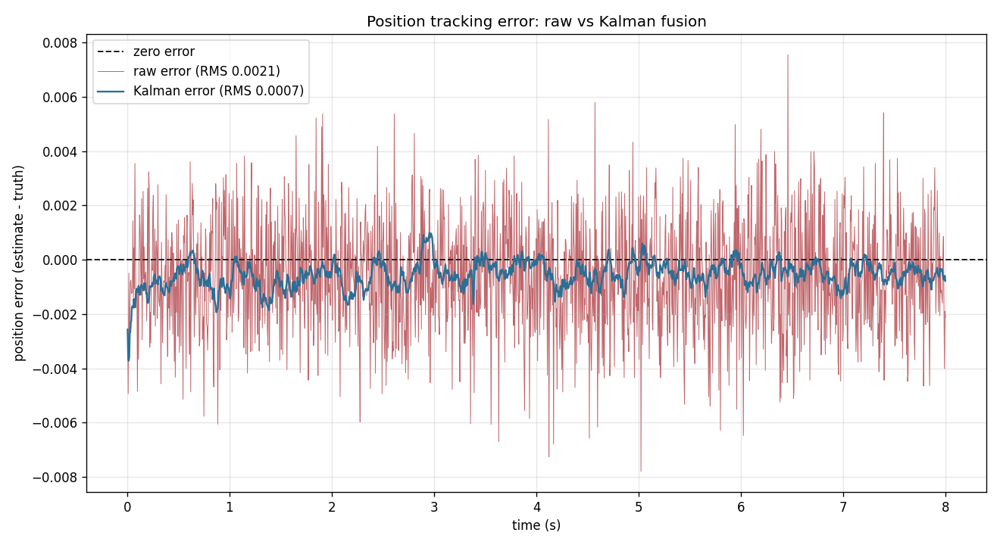

# Real-time multi-sensor fusion pipeline

[](https://github.com/lucaslombanaarias/sensor-fusion-pipeline/actions/workflows/ci.yml)

A modular C++17 pipeline that fuses several concurrent, noisy sensor
streams into a single real-time state estimate at a fixed loop rate,
with measured latency and jitter. One config struct swaps the whole
pipeline between an EV battery-pack monitor (temperature / voltage /
current) and a robot-arm joint estimator (position / velocity / force).

**Standard library only** — no ROS, no Boost, no Eigen. The only
non-stdlib dependency is matplotlib, used by an out-of-process Python
script to plot the CSV output; the pipeline itself has zero external
dependencies.

## Results at a glance

Battery config, 200 Hz estimator, 4 sensors, 30 s run, stock Linux:

- **Fusion latency: 0.38 µs mean** (376 ns), p50 / p99 / p99.9 and max
  all reported per run from a fixed-memory histogram
- **Loop rate: 199.4 Hz** against a 200 Hz target
- **Jitter: 35 µs mean, 102 µs stddev** (OS-scheduler bound)
- **~50,800 sensor samples fused, 0 dropped**
- **Lock-free buffers run ~1.9x lower mean fusion latency than mutex-backed**


The Kalman filter tracking the robot-arm joint, plotted as error vs the
true trajectory — the raw encoder (red) against the filtered estimate
(blue):



Full methodology, the lock-free-vs-locked comparison, and the
tail-latency percentiles are in
[benchmarks/results.md](benchmarks/results.md).

## Architecture

```
 sensor 0 ─► [SPSC ring] ─┐
 sensor 1 ─► [SPSC ring] ─┤
 sensor 2 ─► [SPSC ring] ─┼─► estimator (200 Hz) ─► [SPSC ring] ─► logger ─► CSV
 sensor 3 ─► [SPSC ring] ─┘      fuse + measure
```

Each sensor producer runs in its own thread and publishes a noisy
reading at its configured rate through its own single-producer,
single-consumer ring buffer. The estimator thread runs a fixed-rate
loop: it drains every sensor buffer, fuses the readings into a state
estimate, measures its own latency and jitter, and pushes the result
through a second ring buffer to the logger thread, which writes
timestamped CSV.

The ring buffers fully decouple the threads. A slow disk write can only
ever cause log records to drop — it can never stall the estimator. A
slow estimator can only cause sensor samples to drop — it can never
block a sensor. Nothing on the estimator's hot path takes a lock or
allocates.

## Build and run

CMake:

```bash
mkdir build && cd build
cmake .. && make
ctest --output-on-failure        # run the test suite
./sfp --config battery --duration 30 --compare --csv out.csv
```

Or with the bundled Makefile:

```bash
make            # builds ./build/sfp and the tests
make test       # runs all test suites
./build/sfp --config robotics --duration 30 --csv robot.csv
```

Plot the CSV (needs `pip install matplotlib`):

```bash
python3 scripts/plot_latency.py out.csv latency.png
```

### Windows (MSVC)

The pipeline is standard C++17 and also builds and passes its full test
suite under MSVC. From a *x64 Native Tools* prompt:

```bat
cl /std:c++17 /O2 /EHsc /D_CRT_SECURE_NO_WARNINGS /Iinclude src\main.cpp /Fe:sfp.exe
```

(`_CRT_SECURE_NO_WARNINGS` silences MSVC's nag about standard `fopen`,
which is the warning-free default under g++/clang.)

`include/platform.hpp` requests 1 ms timer resolution on Windows
(`timeBeginPeriod`) for the duration of the process — without it the
default ~15.6 ms scheduler tick prevents the fixed-rate loops from
hitting their deadlines. It is a compiled-out no-op on POSIX. Note that
the **headline latency/jitter figures above are Linux numbers**;
Windows reproduces the lock-free-vs-locked *advantage* but with much
larger scheduler jitter, and sensor rates at/above ~1 kHz are bounded by
the 1 ms Windows timer floor rather than by the pipeline.

### CLI

```
sfp [--config battery|robotics] [--duration SECONDS]
    [--spin-us N] [--csv PATH] [--compare] [--kalman]
```

- `--config`   which sensor set to simulate (default battery)
- `--duration` benchmark length in seconds (default 30)
- `--spin-us`  busy-wait window before each deadline (default 50)
- `--csv`      output path (default fusion_log.csv)
- `--compare`  run lock-free and locked back to back, print a table
- `--kalman`   use the Kalman filter for Position/Velocity instead of the
               complementary filter (meaningful for the robotics config)

## Design notes

### SPSC ring buffer (`include/ring_buffer.hpp`)

The lock-free buffer is the foundation. Key decisions:

- **Monotonic counters, masked indexing.** `head_` and `tail_` count up
  forever; the slot index is `head_ & (Capacity - 1)`. Empty when
  `head == tail`, full when `head - tail == Capacity`. Power-of-two
  capacity (enforced by `static_assert`) makes the wrap a bitmask, not a
  modulo.
- **Acquire/release pairing.** Each thread uses relaxed ordering on the
  counter it owns and acquire/release on the counter the other thread
  publishes. The producer's release-store of `head_` synchronizes with
  the consumer's acquire-load, guaranteeing the buffer write is visible.
- **Cache-line padding.** `head_`, `tail_`, `dropped_`, and the storage
  each sit on their own 64-byte line so the producer and consumer never
  invalidate each other's cache lines (false sharing).
- **Drop on full, never block.** A full buffer drops the new item and
  bumps a counter rather than blocking — staleness beats blocking in a
  real-time loop.

A `LockedRingBuffer` with an identical interface backs the benchmark
comparison.

### Sensor producer (`include/sensor.hpp`)

`value(t) = true_value + drift_rate·t + N(0, noise_stddev)`. Fixed-rate
`sleep_until` loop with deadline resync (no catch-up bursts after a
preemption). RNG seeded per sensor id so same-channel sensors produce
uncorrelated noise.

### Estimator (`include/estimator.hpp`)

The timing-critical thread.

- **Two-stage wait:** coarse `sleep_until(deadline - spin_window)` then a
  busy spin to the deadline, trading ~2% of a core for single-digit-µs
  deadline accuracy on a non-RT kernel.
- **Inverse-variance fusion:** per channel, `fused = Σ(wᵢ·zᵢ) / Σ(wᵢ)`
  with `wᵢ = 1/σᵢ²` — the maximum-likelihood estimator under Gaussian
  noise. Two equal-precision sensors reduce the estimate's stddev by
  1/√2 ≈ 0.707; the estimator test measures ~0.66–0.71 empirically.
- **Complementary filter (robotics config):** the Position channel is
  blended with the velocity integral —
  `pos = α·measured + (1−α)·(prev + v·dt)`. Encoder accuracy at low
  frequency, velocity smoothness at high frequency, and a usable
  position estimate even on ticks with no fresh encoder sample (it
  coasts on integration). In testing this cuts position RMS error
  ~85% versus the raw encoder, and keeps the position present on 100%
  of ticks when the encoder runs at 5 Hz under a 200 Hz loop.
- **Kalman filter (`include/kalman.hpp`, opt-in via `--kalman`):** a
  2-state constant-velocity filter that estimates Position and Velocity
  *jointly*, carrying a full 2×2 covariance. Unlike the per-channel
  average and the fixed-gain complementary filter, the off-diagonal
  covariance term couples the two channels — so a velocity measurement
  sharpens the position estimate and the filter even **infers velocity
  from a position-only ramp**. Each measurement is weighted by its own
  noise; no fixed blend constant. Because every measurement is scalar,
  the gain is one division — no matrix inversion, no allocation.
  Reduces position RMS error ~83% versus the raw encoder in testing.
- **No hot-path allocation:** all per-tick scratch is pre-sized in the
  constructor, so latency variance stays low.
- **Welford stats** (`include/stats.hpp`) accumulate latency and jitter
  in O(1) per tick (mean/stddev/min/max).
- **Tail-latency percentiles** (`include/histogram.hpp`): a fixed-memory,
  log-bucketed histogram records every fusion-latency sample in O(1) and
  reports **p50 / p99 / p99.9** — the mean hides the scheduler-induced
  tail, the percentiles expose it.

### Logger (`include/logger.hpp`)

Drains the `LogRecord` buffer on its own thread and writes CSV. The only
thread that touches the file, so its I/O cost never enters the
estimator's measured latency.

## Testing

Every module has a multithreaded test suite. The concurrency-heavy ones
are also verified under ThreadSanitizer (`cmake -DSFP_TSAN=ON ..`), which
found no data races.

- `test_ring_buffer` — 1M-item in-order streaming; drop-ordering under
  overload; locked-variant parity.
- `test_sensor` — rate, noise mean/stddev, drift tracking, independent
  RNG streams.
- `test_estimator` — convergence to truth; the 1/√2 variance-reduction
  check; multi-channel independence; 200 Hz timing and jitter bounds;
  complementary-filter and Kalman-filter error reduction; velocity coasting.
- `test_logger` — CSV header/columns, value round-trip, zero loss under
  50k records.
- `test_kalman` — filter math in isolation: predict-only coasting,
  covariance shrinkage, velocity inferred from a position-only ramp, and
  a covariance that stays symmetric and positive-semidefinite.
- `test_histogram` — percentile accuracy on constant and uniform streams;
  that a heavy tail lifts p99.9 well above p50.

Compiled with `-Wall -Wextra -Wpedantic -Wshadow -Wconversion
-Wsign-conversion` (g++/clang) or `/W4 /permissive-` (MSVC) and clean.
CI builds and runs the suite on Linux (g++) and Windows (MSVC), plus
Linux builds under Address/UB and Thread sanitizers.

## Layout

```
sensor-fusion-pipeline/
├── README.md
├── CMakeLists.txt
├── Makefile
├── include/
│   ├── ring_buffer.hpp      SPSC + locked variants
│   ├── messages.hpp         SensorReading, FusedState, LogRecord
│   ├── config.hpp           SensorConfig, EstimatorConfig
│   ├── pipeline_config.hpp  battery_config(), robotics_config()
│   ├── stats.hpp            Welford RunningStats
│   ├── histogram.hpp        LatencyHistogram (p50/p99/p99.9)
│   ├── sensor.hpp           SensorProducer<Buffer>
│   ├── estimator.hpp        Estimator<SensorBuffer, LogBuffer>
│   ├── kalman.hpp           KalmanFilter2 (constant-velocity)
│   ├── logger.hpp           Logger<LogBuffer>
│   ├── platform.hpp         ScopedHighResTimer (Windows timer shim)
│   └── benchmark.hpp        run_pipeline<...>()
├── src/
│   └── main.cpp             CLI + orchestration
├── tests/
│   ├── test_ring_buffer.cpp
│   ├── test_sensor.cpp
│   ├── test_estimator.cpp
│   ├── test_logger.cpp
│   ├── test_kalman.cpp
│   ├── test_histogram.cpp
│   └── test_util.hpp
├── scripts/
│   ├── plot_latency.py
│   └── plot_fusion.py      raw vs filtered (the money plot)
└── benchmarks/
    ├── results.md
    ├── battery_latency.png
    ├── battery_sample.csv
    ├── robotics_latency.png
    └── robotics_sample.csv
```

## Possible extensions

- Extend the Kalman filter to a 3-state (position, velocity,
  acceleration) model, or a full multi-dimensional EKF for nonlinear
  motion — the current `kalman.hpp` is a 2-state constant-velocity
  starting point.
- CPU pinning + `SCHED_FIFO` to push jitter down another order of
  magnitude and remove the millisecond-scale scheduler spikes.
- A multi-producer buffer variant if a single channel ever needs more
  than one writer.
